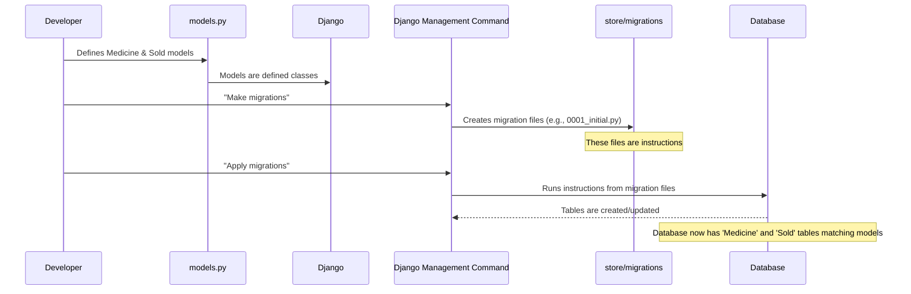

# Chapter 1: Database Models

Welcome to the first chapter of our tutorial for the Pharmacy Management System project!

Think about what this system needs to do. It needs to keep track of all the medicines available and all the sales that happen. Where does all this information go? It needs to be stored somewhere safe and organized. This "somewhere" is usually a database.

But how do we tell our web application (which uses a framework called Django) how to talk to this database? How do we define *exactly* what information needs to be stored for each medicine, or for each sale? This is where **Database Models** come in!

## What are Database Models?

In Django, a **Model** is essentially a blueprint or a template. It tells Django:

1.  What kind of data you want to store (like text, numbers, dates).
2.  How to organize this data into structures that look like tables in a database.

Let's use an analogy: If you were building a house, the architect draws blueprints. These blueprints show the structure – where the walls are, where the doors go, etc. In our project, our Django models are like blueprints for the database. They show the structure of our data – what "rooms" (pieces of information) are needed and how they are organized.

For our Pharmacy Management System, we primarily need to store information about:

*   **Medicines:** Their names, prices, how many we have in stock, etc.
*   **Sales:** Which medicine was sold, how many, to whom, and when.

These two main things become our main **Models**.

## Defining Our Models

Django models are defined using Python classes. You'll find them in a file usually called `models.py` inside your Django app (we'll talk more about apps in the next chapter: [Django Application (App)](02_django_application__app__.md)).

Let's look at the `store/models.py` file in our project.

```python
# File: store/models.py

from django.db import models
# ... other imports ...

# Create your models here.
class Medicine(models.Model):
    # This field is an automatic unique number for each medicine
    Medicine_ID = models.AutoField(primary_key=True)
    # Text field for the medicine's name
    Medicine_Name = models.CharField(max_length=50)
    # Text field for the company name
    Company_name = models.CharField(max_length=30)
    # Number field for the company ID (default is "null", but IntegerField usually defaults to 0 or requires null=True)
    Company_ID = models.IntegerField(default="null")
    # Date field for manufacturing date
    Manufacturing_date = models.DateField("Mfg Date (MM/DD/YYYY)")
    # Date field for expiry date
    Expiry_date = models.DateField("Exp Date (MM/DD/YYYY)")
    # Number field for price (can have decimals)
    Price = models.FloatField()
    # Number field for stock quantity
    stock = models.IntegerField()

    # This method defines how the model object is displayed as a string
    def __str__(self):
        return str(self.Medicine_ID)

# ... Sold model definition below ...
```

Let's break down the `Medicine` model class:

*   `class Medicine(models.Model):`: This line says we are creating a model named `Medicine`. `models.Model` tells Django that this class should be treated as a database model.
*   `Medicine_ID = models.AutoField(primary_key=True)`: This defines a field named `Medicine_ID`. `AutoField` is a special type that automatically creates a unique integer ID for each new medicine added. `primary_key=True` means this field is the unique identifier for each record (row) in the database table, kind of like an employee ID number.
*   `Medicine_Name = models.CharField(max_length=50)`: This defines a text field for the medicine's name. `CharField` is used for short text. `max_length` is important because it tells the database the maximum number of characters allowed for this field.
*   `Company_name = models.CharField(max_length=30)` and `Company_ID = models.IntegerField(...)`: These store information about the manufacturer. `IntegerField` is for whole numbers.
*   `Manufacturing_date = models.DateField(...)` and `Expiry_date = models.DateField(...)`: These are fields specifically for storing dates. The text inside the `DateField(...)` is just a user-friendly label for forms and the Django admin site.
*   `Price = models.FloatField()`: This field stores numbers that can have decimal points, suitable for currency.
*   `stock = models.IntegerField()`: This stores the quantity of medicine in stock as a whole number.
*   `def __str__(self):`: This is a standard Python method. When you look at a `Medicine` object (like in the Django admin), this method tells Django what text to display for it. Here, it will display the `Medicine_ID`.

Now, let's look at the `Sold` model in the same `store/models.py` file:

```python
# File: store/models.py

# ... Medicine model definition above ...

class Sold(models.Model):
    # Text field for company name (duplicated from Medicine - often related models might link instead of duplicating data)
    Company_name = models.CharField(max_length=30)
    # Text field for medicine name (duplicated from Medicine)
    Medicine_Name = models.CharField(max_length=50)
    # Date field for manufacturing date (duplicated from Medicine)
    Manufacturing_date = models.DateField("Mfg Date (MM/DD/YYYY)")
    # Date field for expiry date (duplicated from Medicine)
    Expiry_date = models.DateField("Exp Date (MM/DD/YYYY)")
    # Number field for price (duplicated from Medicine)
    Price = models.FloatField()
    # Text field for customer name
    Customer_name = models.CharField(max_length=30)
    # Number field for phone number
    Phone_number = models.IntegerField()
    # Number field for quantity sold
    Quantity = models.IntegerField()
    # Number field for the total bill amount
    Bill_amount = models.FloatField()
    # Date field for the purchase date
    Purchase_date = models.DateField("Purchase Date (MM/DD/YYYY)")
    # Automatic unique number for each sale record
    Purchase_ID = models.AutoField(primary_key=True)
    # Number field for a person ID (maybe related to a user or customer)
    Person_ID = models.IntegerField()
    # Number field for company ID (duplicated from Medicine)
    Company_ID = models.IntegerField(default=0)
    # Number field for medicine ID (duplicated from Medicine - ideally this would link to the Medicine model)
    Medicine_ID = models.IntegerField(default=0)

    # This method defines how the model object is displayed as a string
    def __str__(self):
        return str(self.Purchase_ID)
```
The `Sold` model follows the same pattern. It defines all the pieces of information needed for a sales record: details about the customer, the medicine sold (some fields are repeated from the `Medicine` model for simplicity in this project's structure), the quantity, the total amount, and the date. It also has its own unique `Purchase_ID`.

These two classes, `Medicine` and `Sold`, are our database models. They are the core definitions of the data structures our application will use.

## Models and the Database: Migrations

Once you define your models in `models.py`, Django doesn't automatically create the tables in the real database yet. You need to tell Django to prepare the instructions for the database. These instructions are called **Migrations**.

Migrations are Python files that describe the changes needed to your database schema (like creating new tables or adding columns) to match your models. You can see examples of migration files in the `store/migrations/` folder, like `0001_initial.py`.

```python
# File: store/migrations/0001_initial.py

# Generated by Django ...

from django.db import migrations, models

class Migration(migrations.Migration):

    initial = True # This means this is the first migration

    dependencies = [
    ]

    operations = [
        migrations.CreateModel( # This operation creates a model's table
            name='Medicine', # The name of the model (and table)
            fields=[ # The fields (columns) for the table
                ('Medicine_ID', models.AutoField(primary_key=True, serialize=False)),
                ('Medicine_Name', models.CharField(max_length=50)),
                # ... other fields ...
            ],
        ),
        migrations.CreateModel( # Another operation to create the Sold table
             name='Sold',
             fields=[
                # ... fields for Sold model ...
                ('Purchase_ID', models.AutoField(primary_key=True, serialize=False)),
             ]
        )
    ]
```
This `0001_initial.py` file, generated by Django, contains the step-by-step instructions (`operations`) to create the `Medicine` and `Sold` tables in the database based on the models we defined.

You (or the project developer) tell Django to create these migration files, and then tell Django to "apply" them, which means running these instructions against your database to actually build the tables.

Here's a simple flow of how models relate to the database:



So, models are the definition in Python, migrations are the translation of that definition into database language, and applying migrations is the action that makes the database structure match your models.

## Summary

In this chapter, we learned that:

*   Database models are the blueprints for how our data is structured in the database.
*   In Django, models are defined as Python classes inheriting from `models.Model`.
*   Each field in the class (`CharField`, `IntegerField`, `DateField`, etc.) defines a column in the database table and the type of data it holds.
*   We looked at the `Medicine` and `Sold` models in our project, which define the structure for storing information about drugs and sales, respectively.
*   We briefly touched upon migrations, which are the steps Django uses to create and update the database tables based on our model definitions.

Now that we understand how our data is structured, let's look at where these models live within the project and how Django organizes different parts of our application.

Let's move on to the next chapter: [Django Application (App)](02_django_application__app__.md).
