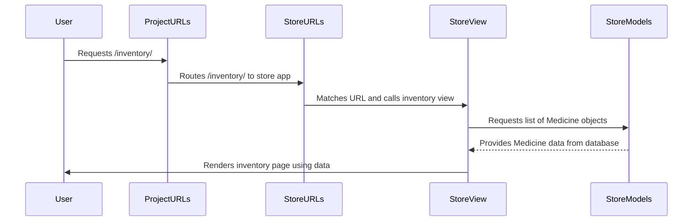

# Chapter 2: Django Application (App)

Welcome back! In [Chapter 1: Database Models](01_database_models_.md), we learned about defining the structure of our data using models in Django. We saw the `Medicine` and `Sold` models that tell Django how to store information about our pharmacy items and sales. But where do these models live? And how do we organize all the different pieces of code that make up our Pharmacy Management System?

This is where **Django Applications**, or **Apps**, come in.

## What is a Django App?

Imagine you're building a large company. You wouldn't just have one giant room where everyone does everything, right? You'd create different departments: Sales, Inventory, HR, Accounting, etc. Each department is responsible for a specific part of the business and has its own teams and tools.

In Django, a **Project** is like the entire company, and **Apps** are like the different departments within that company.

A Django App is a self-contained module that handles a specific feature or set of related features. It has its own files for handling data (models), displaying information (views), managing web addresses (URLs), and more.

For our Pharmacy Management System project, the main "department" dealing with everything related to medicines, inventory, adding stock, and recording sales is the **`store` app**.

## Why Use Apps?

Using apps helps organize your code. Instead of having one huge file with everything in it, you break down your project into smaller, manageable pieces. This makes your code:

*   **Organized:** Each app has a clear purpose.
*   **Reusable:** You can potentially take an app and use it in a different Django project.
*   **Maintainable:** It's easier to find and fix code when it's logically grouped.

Think of it like building with Lego bricks. Each app is a specialized brick (like a wheel assembly or a roof section) that fits together with other bricks to create the final structure (the whole project).

## The `store` App in Our Project

Our Pharmacy Management System has one main app called `store`. This app contains all the core logic for managing the pharmacy inventory and sales.

Let's look inside the `store` directory in our project files. You'll see several files and folders:

```
pharmacy_management_system/
├── manage.py
├── pharmacy_management_system/
│   ├── __init__.py
│   ├── asgi.py
│   ├── settings.py     <- Project-wide settings (Next chapter!)
│   ├── urls.py         <- Project-wide URL routing
│   └── wsgi.py
└── store/              <- This is our app!
    ├── __init__.py
    ├── admin.py        <- For setting up the Django admin site
    ├── apps.py         <- App configuration
    ├── filters.py      <- For filtering data (Later chapter)
    ├── forms.py        <- For handling web forms (Later chapter)
    ├── migrations/     <- Database changes (Chapter 1 connection)
    │   └── 0001_initial.py
    ├── models.py       <- Database models (Chapter 1!)
    ├── urls.py         <- URL routing specific to the store app
    └── views.py        <- The logic behind the pages (Later chapter)
```

As you can see, the `store` directory contains specific files that are part of this app.

*   `models.py`: This is where we defined our `Medicine` and `Sold` models in [Chapter 1: Database Models](01_database_models_.md). These models are specific to the `store` app's functionality.
*   `views.py`: This file will contain the *views* for our app. Views are like the "workers" in our department – they receive requests (like someone visiting a page), do some processing (like fetching data using our models), and send back a response (like showing a web page). We'll cover [Views](05_views_.md) in detail later.
*   `urls.py`: This file defines the web addresses (URLs) that belong to the `store` app. For example, `/inventory/` or `/addmedicine/`. We'll explore [URL Routing](06_url_routing_.md) later.
*   `forms.py`: This file contains the definitions for the forms users will fill out, like adding a new medicine or recording a sale. We'll learn about [Forms](04_forms_.md) soon.
*   `migrations/`: This folder holds the migration files we talked about in [Chapter 1: Database Models](01_database_models_.md), generated specifically for the models in the `store` app.
*   `admin.py`: This file is used to register our `Medicine` and `Sold` models so we can manage them easily using Django's built-in administration site.

These files work together within the `store` app to handle all the pharmacy-related tasks.

## How the Project Knows About the App

Creating the `store` directory with the files isn't enough. The main Django project needs to know that the `store` app exists and is part of the project.

This is done by adding the app's configuration to the project's `settings.py` file.

You'll find a file named `apps.py` inside the `store` directory. This file contains a class (usually named `StoreConfig`) that tells Django about the app.

```python
# File: store/apps.py

from django.apps import AppConfig

class StoreConfig(AppConfig):
    default_auto_field = 'django.db.models.BigAutoField'
    name = 'store' # This is the name Django uses to identify the app

```

The important part here is `name = 'store'`. This tells Django the name of our app.

To include this app in our project, we need to add its name to the `INSTALLED_APPS` list in the main project's `settings.py` file.

We'll dive much deeper into `settings.py` in the next chapter, but for now, just know that there's a list like this:

```python
# File: pharmacy_management_system/settings.py (Snippet)

INSTALLED_APPS = [
    'django.contrib.admin',
    'django.contrib.auth',
    'django.contrib.contenttypes',
    'django.contrib.sessions',
    'django.contrib.messages',
    'django.contrib.staticfiles',
    'store.apps.StoreConfig', # <-- Our store app is added here!
    'django_filters', # Another installed app
]

# ... rest of the settings file ...
```

By adding `'store.apps.StoreConfig'` (or sometimes just `'store'`) to `INSTALLED_APPS`, we're telling the main Django project, "Hey, there's a department named 'store', and it's part of this company. Make sure you include its models, views, and other components when you run."

## Putting it Together

Let's visualize how a simple request might flow into our `store` app once it's connected to the project. Imagine a user wants to see the inventory.



This is a simplified flow, but it shows how the project (`ProjectURLs`) directs traffic to the relevant app (`StoreURLs`), the app's URL configuration points to the correct logic (`StoreView`), and that logic interacts with the data definitions (`StoreModels`) we learned about in the first chapter.

## Summary

In this chapter, we learned that:

*   A Django project is typically broken down into smaller, self-contained modules called **Apps**.
*   Apps help organize code by feature or functionality.
*   Our Pharmacy Management System uses a single main app called `store` to handle all pharmacy-related logic.
*   The `store` app contains files like `models.py`, `views.py`, `urls.py`, and `forms.py`, each responsible for a different part of the app's features.
*   Apps must be registered in the project's `settings.py` file so the project knows they exist.

Understanding the concept of apps and the basic structure of our `store` app is crucial. It provides the framework for how all the other pieces – models, views, forms, URLs – fit together.

Now that we know how our project is structured into apps, let's look at some of the important project-wide settings that control how everything works together.

Let's move on to the next chapter: [Django Project Settings](03_django_project_settings_.md).
