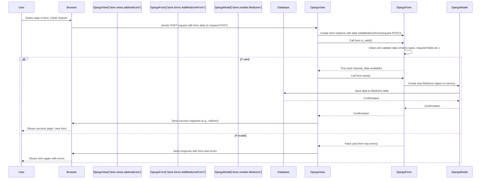

# Chapter 4: Forms

Welcome back! In [Chapter 1: Database Models](01_database_models_.md), we designed the structure for our pharmacy data (`Medicine`, `Sold`). In [Chapter 2: Django Application (App)](02_django_application__app__.md), we organized our code into the `store` app. And in [Chapter 3: Django Project Settings](03_django_project_settings_.md), we saw how the whole project is configured.

Now, let's think about how the Pharmacy Management System actually gets information *from* a person using the system. How do we add a new medicine to the inventory? How do we record a sale? Users can't directly talk to the database models!

We need a way for users to input data through web pages. This is where **Forms** come in.

## What are Forms?

Imagine you go to a doctor's office and need to fill out a new patient form. It asks for your name, address, date of birth, etc. This paper form has specific boxes for specific information. You fill it out, the receptionist checks if you filled everything required (validation!), and then the information is processed and stored in their system.

In web development, especially with Django, **Forms** serve a similar purpose. They are tools that help you:

1.  **Display an HTML form:** Generate the input fields (like text boxes, date pickers, number fields) on a web page based on the data you need.
2.  **Collect user input:** Receive the data the user types into those fields when they submit the form.
3.  **Validate data:** Check if the input is in the correct format (Is the date really a date? Is the quantity a number? Is the required field filled?).
4.  **Clean data:** Convert the input into the correct Python data types (e.g., convert the date string from the browser into a Python `date` object).
5.  **Prepare data for processing/saving:** Make the validated and cleaned data easily available to your code, often for saving into your database models.

Using Django Forms saves you a lot of manual work. You don't have to write all the HTML form tags by hand for simple fields, and you definitely don't have to write all the validation code yourself – Django handles a lot of that based on your model definitions!

## Forms and Models: `ModelForm`

Django provides different types of forms. For our Pharmacy Management System, since most of the data we collect directly corresponds to fields in our [Database Models](01_database_models_.md) (`Medicine` and `Sold`), the most convenient type is `ModelForm`.

A **`ModelForm`** is a special kind of form that is built directly from a Django Model. It automatically knows:

*   Which fields to include in the form (based on the model's fields).
*   What kind of HTML input to generate for each field (a text input for `CharField`, a number input for `IntegerField`, a date input for `DateField`, etc.).
*   Basic validation rules based on the model field properties (like `max_length` for `CharField` or data type).

Think of a `ModelForm` as a form designer that looks at your Model blueprint and automatically draws the paper form for you, complete with labels and space for each piece of information defined in the model.

## Defining Our Forms

Our forms are defined as Python classes in the `store/forms.py` file, located within our `store` app (which we learned about in [Chapter 2: Django Application (App)](02_django_application__app__.md)).

Let's look at the `AddMedicineForm` from that file:

```python
# File: store/forms.py (Snippet)

from django import forms
from .models import Medicine # Import the Medicine model

# ... other forms ...

class AddMedicineForm(forms.ModelForm):
    class Meta: # This inner class links the form to a model
        model = Medicine # Specify which model this form is for
        fields = ["Medicine_Name","Company_ID","Company_name","Manufacturing_date","Expiry_date","Price", "stock"] # Specify which fields from the model to include

# ... other forms ...
```

Breaking it down:

*   `from .models import Medicine`: We import the `Medicine` model because our form will be based on it.
*   `class AddMedicineForm(forms.ModelForm):`: This declares a class named `AddMedicineForm` that *inherits* from `forms.ModelForm`. This tells Django it's a ModelForm.
*   `class Meta:`: This is a standard Django convention for ModelForms. The inner `Meta` class is where you tell the `ModelForm` which model to use and which fields from that model should be included in the form.
*   `model = Medicine`: This line links the form to our `Medicine` model.
*   `fields = [...]`: This list specifies exactly which fields from the `Medicine` model should appear on this form. We've listed fields like `Medicine_Name`, `Price`, `stock`, etc. The order in this list is often the order they appear in the generated HTML form.

Similarly, the `SellMedicineForm` is based on the `Sold` model:

```python
# File: store/forms.py (Snippet)

# ... other forms and imports ...

class SellMedicineForm(forms.ModelForm):
    class Meta:
        model = Sold # Link to the Sold model
        fields = ["Person_ID","Customer_name","Medicine_ID","Medicine_Name","Company_ID","Company_name","Manufacturing_date","Expiry_date","Price","Quantity", "Phone_number", "Purchase_date"] # Fields from the Sold model
```

This `SellMedicineForm` includes fields needed to record a sale, pulling many details directly from the `Sold` model definition we saw in [Chapter 1: Database Models](01_database_models_.md).

These `forms.py` files define *how* the forms should look and behave, but they don't actually *do* anything yet. We need our [Views](05_views_.md) to use these form definitions.

## Using Forms in Views

The main place where forms are handled is in Django's [Views](05_views_.md). A view function typically does the following when dealing with a form:

1.  **On a `GET` request:** Create an empty instance of the form and pass it to the template so the user can see and fill it.
2.  **On a `POST` request:** Create a form instance populated with the data received from the user's browser. Then, check if the form data is valid. If it is, process the data (e.g., save it to the database). If not, send the form back to the template, often with error messages.

Let's look at a simplified version of the `addmedicine` view function from `store/views.py`:

```python
# File: store/views.py (Simplified Snippet)

# ... imports ...
from .forms import AddMedicineForm # Import the form we defined

# ... other views ...

def addmedicine(request):
    # Check if the request method is POST (form submitted)
    if request.method == "POST":
        # Create a form instance and populate it with data from the request
        fm = AddMedicineForm(request.POST)

        # Check if the submitted data is valid according to the form's rules
        if fm.is_valid():
            # If valid, the data is cleaned and ready.
            # For ModelForms, .save() can create/update a model instance directly!
            fm.save()

            # After saving, usually redirect the user to another page
            # return redirect('Inventory') # Example redirect

            # Or clear the form for another entry and show success
            fm = AddMedicineForm() # Create a new blank form
            status_message = "Medicine added successfully!"
            return render(request, 'store/addmedicine.html', {"form": fm, "status": status_message}) # Render the template with a new form and message

    # If the request method is not POST (it's likely GET, initial page load)
    else:
        # Create a blank form instance
        fm = AddMedicineForm()

    # Render the HTML template, passing the form instance to it
    return render(request, 'store/addmedicine.html', {'form':fm})

# ... other views ...
```

Let's trace the flow:

*   A user navigates to the "Add Medicine" page (a `GET` request).
*   The `else` block runs. `fm = AddMedicineForm()` creates an empty form instance.
*   `render(...)` is called, passing the empty `fm` object to the `store/addmedicine.html` template.
*   Inside `addmedicine.html` (which we'll see when we cover templates), code like `{{ form.as_p }}` would generate the HTML `<form>` tags and input fields. The user sees a blank form.

*   The user fills the form and clicks "Submit" (a `POST` request).
*   The `if request.method == "POST":` block runs.
*   `fm = AddMedicineForm(request.POST)` creates a form instance, but this time, it's populated with the data the user submitted, which is available in `request.POST`.
*   `if fm.is_valid():` is the magic step! Django checks each piece of submitted data against the validation rules defined by the form (which come from the `Medicine` model and default form validation).
    *   If validation fails (e.g., user entered text in a number field, left a required field blank), `is_valid()` returns `False`, and the form instance `fm` now contains error messages. The code inside the `if fm.is_valid():` block is skipped. The `render` call at the end of the function is reached, passing the form *with errors* back to the template. The user sees the form again, but this time filled with their previous input and error messages next to the problematic fields.
    *   If validation succeeds, `is_valid()` returns `True`. The data is cleaned (converted to Python types) and stored in `fm.cleaned_data` (though for `ModelForm.save()`, you often don't need to access `cleaned_data` directly).
*   `fm.save()`: Because `fm` is a `ModelForm` instance with valid data, calling `.save()` automatically creates a new `Medicine` object in the database with the submitted data.
*   After saving, the code redirects or renders a success message with a fresh form, as shown in the simplified example.

This process is fundamental to handling user input in Django!

## How Forms Work (Under the Hood - Simplified)

Let's visualize the `POST` request flow when adding medicine:



Key steps in this flow:

1.  The view receives the `POST` data.
2.  The view creates a form instance, passing it the `request.POST` data.
3.  The view calls `form.is_valid()`.
4.  The `DjangoForm` instance performs cleaning and validation on the data. This involves checking against the rules derived from the `Medicine` model's field types and constraints.
5.  If valid, `form.save()` (for `ModelForm`) automatically handles creating/updating the corresponding model instance and saving it to the database.
6.  If invalid, the form object itself holds the error messages, which the view can then pass back to the template to display to the user.

This process ensures that only clean, correctly formatted data makes its way into your [Database Models](01_database_models_.md).

## Summary

In this chapter, we learned about **Forms** in Django, which are essential tools for handling user input via web pages.

*   Forms generate HTML form elements, collect user data, and validate it.
*   `ModelForm` is a convenient type of form built directly from a Django model, automatically including fields and basic validation based on the model definition.
*   We saw our project's `AddMedicineForm` and `SellMedicineForm`, defined in `store/forms.py`, linking to the `Medicine` and `Sold` models respectively.
*   We explored how forms are used within [Views](05_views_.md), including:
    *   Creating an empty form for initial display (`GET` request).
    *   Creating a form with submitted data (`POST` request).
    *   Calling `is_valid()` to trigger validation.
    *   Using `form.save()` on a valid `ModelForm` to automatically save data to the database.
*   We briefly looked at the underlying flow of data from the user through the form validation process and into the database.

Forms bridge the gap between the user interface (web pages) and your application's data structures ([Database Models](01_database_models_.md)). They are a fundamental part of building interactive web applications with Django.

Now that we understand forms, let's see how they fit into the broader picture of handling web requests and generating responses. This is the job of [Views](05_views_.md)!

Let's move on to the next chapter: [Views](05_views_.md).
