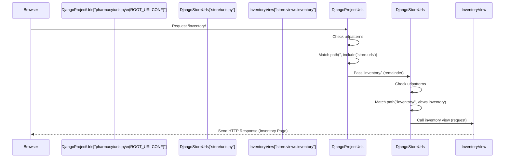
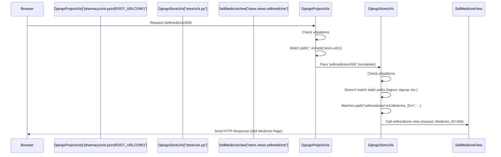

# Chapter 6: URL Routing

Welcome back, aspiring pharmacy system developers! We've been building the essential pieces of our Pharmacy Management System:
*   [Chapter 1: Database Models](01_database_models_.md) showed us how to structure our data.
*   [Chapter 2: Django Application (App)](02_django_application__app__.md) taught us to organize our code into manageable apps.
*   [Chapter 3: Django Project Settings](03_django_project_settings_.md) covered the overall configuration of our project.
*   [Chapter 4: Forms](04_forms_.md) explained how we get input from users.
*   [Chapter 5: Views](05_views_.md) showed us the "chef" functions that handle requests, interact with data, process forms, and prepare responses.

Now, imagine you type a web address like `/inventory/` or `/addmedicine/` into your browser. How does Django know *which* specific view function (like `inventory` or `addmedicine` from our `store/views.py` file) should handle that request?

This is the job of **URL Routing**!

Think of URL routing as the navigation system or the switchboard of your web application. When a request comes in with a specific web address (a URL), the URL router looks at that address and directs the request to the correct "handler" – which, in Django, is typically a [View](05_views_.md) function.

It's like looking up an address on a map to find the right building. The URL is the address, and the routing system finds the corresponding view function (the building) that knows how to handle visitors (requests) for that address.

## What is URL Routing?

In essence, URL routing in Django involves:

1.  Defining **URL patterns**: These are rules that describe the format of different web addresses your application can respond to (e.g., `/inventory/`, `/sellmedicine/`, `/about/`).
2.  Mapping these patterns to **[View](05_views_.md) functions**: Each pattern is associated with a specific view function that will be executed when a URL matching that pattern is requested.

Django processes an incoming URL by trying to match it against a list of these defined patterns. The first pattern that matches determines which view function gets called.

## How URLs are Organized: Project vs. App URLs

Django projects typically organize URL patterns in a hierarchical way, mirroring the project and app structure we discussed in [Chapter 2: Django Application (App)](02_django_application__app__.md).

*   **Project-level URLs:** There is a main `urls.py` file at the root of your project directory (`pharmacy/urls.py`). This is the first place Django looks.
*   **App-level URLs:** Each app (`store/` in our case) can (and usually does) have its own `urls.py` file (`store/urls.py`). This file contains URL patterns specific to that app's features.

The main project `urls.py` acts like a central hub that includes or "points to" the URL configurations of individual apps. This keeps the main file clean and allows apps to manage their own addresses.

Let's use our post office analogy again:
*   The **Project `urls.py`** is the main postal distribution center. All incoming mail first arrives here.
*   It looks at the *start* of the address (the base part of the URL).
*   It then forwards the mail for a specific neighborhood (like addresses starting with `/store/...`) to the **App `urls.py`** for that neighborhood (the local post office).
*   The **App `urls.py`** then figures out the rest of the address and delivers the mail to the specific house or building (the [View](05_views_.md)).

## Looking at the Project `urls.py` (`pharmacy/urls.py`)

The main project's URL configuration is defined in `pharmacy/urls.py`. Remember from [Chapter 3: Django Project Settings](03_django_project_settings_.md), the `ROOT_URLCONF` setting tells Django to start here.

```python
# File: pharmacy/urls.py

from django.contrib import admin
from django.urls import path, include # Need include!

urlpatterns = [
    path('admin/', admin.site.urls),      # Pattern for the Django admin site
    path('', include('store.urls')),      # ALL other paths are sent to store.urls
    path('', include('django.contrib.auth.urls')), # Paths for Django's built-in auth views
]
```

*   `from django.urls import path, include`: We import the necessary functions. `path()` is used to define a single URL pattern. `include()` is used to reference other `urls.py` files.
*   `urlpatterns = [...]`: This is the crucial list. Django goes through this list *in order* from top to bottom to find a matching pattern.
*   `path('admin/', admin.site.urls)`: This is a pattern that matches URLs starting with `admin/`. If a URL like `/admin/` or `/admin/login/` is requested, Django will delegate handling to Django's built-in admin URL configuration (`admin.site.urls`).
*   `path('', include('store.urls'))`: This is the key line for our app. The first argument, `''`, means "match any URL that starts with an empty string" (which is *all* URLs after any preceding matches failed). The second argument, `include('store.urls')`, tells Django to "cut off" the matched part (the empty string in this case) and then look inside the `urls.py` file located in the `store` app directory (i.e., `store/urls.py`) for further matching.

So, essentially, any URL that doesn't start with `admin/` will be passed along to our `store` app's URL configuration. This is a common setup where the project `urls.py` handles root-level concerns (like admin) and includes app-specific URLs for everything else.

The line `path('', include('django.contrib.auth.urls'))` does a similar thing, including URL patterns for Django's built-in authentication system (like login, logout, password reset), which our project uses ([Chapter 7: Authentication](07_authentication_.md)). Since it also matches `''`, its patterns will be considered *after* the `store.urls` patterns if the `store` patterns don't match.

## Looking at the App `urls.py` (`store/urls.py`)

Now let's look at the `store/urls.py` file, where the specific paths for our pharmacy features are defined.

```python
# File: store/urls.py

from django.urls import path, include
from django.contrib import admin
from django.contrib.auth import views as auth_views # For password reset views
from .import views # Import views from the current directory (store/views.py)


urlpatterns = [
    path("", views.loginPage, name="Login"), # Matches "" (after project "" match) -> loginPage view
    path("logout/", views.logoutUser, name="Logout"), # Matches logout/ -> logoutUser view
    path("signup/", views.signup, name="Signup"),   # Matches signup/ -> signup view
    path("home/", views.index, name="StoreHome"),   # Matches home/ -> index view
    path("about/", views.about, name="AboutUs"),   # Matches about/ -> about view
    path("addmedicine/", views.addmedicine, name="AddMedicine"), # Matches addmedicine/ -> addmedicine view
    path("inventory/", views.inventory, name="Inventory"), # Matches inventory/ -> inventory view
    path("sellmedicine/<int:Medicine_ID>/", views.sellmedicine, name="SellMedicine"), # Matches sellmedicine/ + integer -> sellmedicine view
    path("records/", views.records, name="Records"), # Matches records/ -> records view
    path("delete/<int:Medicine_ID>/", views.delete_med, name="DeleteMed"), # Matches delete/ + integer -> delete_med view
    path("delete_rec/<int:Purchase_ID>/", views.delete_rec, name="DeleteRec"), # Matches delete_rec/ + integer -> delete_rec view
    path("<int:Medicine_ID>/", views.update_med, name="UpdateMed"), # Matches just integer -> update_med view (Order matters!)
    # Note: The default auth urls are included via the project urls.py already,
    # but password reset specific ones are sometimes added here for clarity
    path("password_reset/", auth_views.PasswordResetView.as_view(template_name="store/password_reset_form.html"), name="password_reset_form"),
    # ... other password reset paths ...
]
```

Here's how the patterns in this `urlpatterns` list work:

*   `path("", views.loginPage, name="Login")`: This pattern matches an empty string (`""`). Because the project `urls.py` includes `store.urls` with `path('', ...)`, this specific pattern in `store/urls.py` will match the root URL `/` *after* the project's empty string is stripped off. It maps the root URL to the `loginPage` view function. The `name="Login"` gives this pattern a convenient name we can use elsewhere.
*   `path("home/", views.index, name="StoreHome")`: This matches the path `home/` and maps it to the `views.index` function. So, a request to `/home/` (after being passed from the project `urls.py`) will trigger the `views.index` function.
*   `path("addmedicine/", views.addmedicine, name="AddMedicine")`: Matches `addmedicine/` and calls `views.addmedicine`. A request to `/addmedicine/` goes here.
*   `path("inventory/", views.inventory, name="Inventory")`: Matches `inventory/` and calls `views.inventory`. A request to `/inventory/` goes here.

These are examples of simple, static URL patterns. But what about URLs that change, like viewing or selling a *specific* medicine?

### URL Patterns with Variables

Sometimes, the URL needs to include dynamic information, like the ID of the item you're looking at. This is handled using **path converters**:

*   `path("sellmedicine/<int:Medicine_ID>/", views.sellmedicine, name="SellMedicine")`: This pattern matches URLs starting with `sellmedicine/`, followed by an integer, and then a trailing slash `/`.
    *   `<int:Medicine_ID>` is the path converter.
    *   `int` specifies that the part of the URL matched by this converter must be an integer (a whole number).
    *   `Medicine_ID` is the name assigned to this captured integer value.
    *   When Django matches a URL like `/sellmedicine/123/` against this pattern, it captures `123`, converts it to an integer, and passes it to the view function as a keyword argument named `Medicine_ID`.

Recall the `sellmedicine` view function signature from [Chapter 5: Views](05_views_.md):

```python
# File: store/views.py (Snippet)

# ... imports ...

def sellmedicine(request, Medicine_ID): # It expects 'request' and 'Medicine_ID'
    # Use the Medicine_ID captured from the URL
    pi = Medicine.objects.get(pk=Medicine_ID)
    # ... rest of the view logic ...
```

The name used in the URL pattern (`<int:Medicine_ID>`) must match the name of the argument in the view function (`def sellmedicine(..., Medicine_ID):`) so Django knows how to pass the captured value.

Other patterns use similar converters:
*   `path("delete/<int:Medicine_ID>/", ...)`: Captures an integer as `Medicine_ID` for the `delete_med` view.
*   `path("delete_rec/<int:Purchase_ID>/", ...)`: Captures an integer as `Purchase_ID` for the `delete_rec` view.
*   `path("<int:Medicine_ID>/", ...)`: This pattern is interesting because it *only* matches an integer followed by a slash. If placed higher in the list, it might incorrectly match things like `/123/` which you intended for `/sellmedicine/123/`. **The order of patterns in `urlpatterns` is important!** In this file, it's near the end, so it will only match if none of the preceding patterns match. It's used for the `update_med` view, meaning a URL like `/123/` might be used to update the medicine with ID 123.

## How Routing Works (Step-by-Step)

Let's trace the journey of a request for `/inventory/` and a request for `/sellmedicine/456/`.

**Request: `/inventory/`**



1.  The user's browser requests `/inventory/`.
2.  Django receives the request and looks at the `ROOT_URLCONF` (`pharmacy/urls.py`).
3.  It goes through `pharmacy/urls.py`'s `urlpatterns`.
4.  It doesn't match `admin/`.
5.  It matches `path('', include('store.urls'))`. Since the path is `''`, it strips nothing and passes the full remaining path (`inventory/`) to `store.urls.py`.
6.  Django now looks at `store/urls.py`'s `urlpatterns`.
7.  It goes through the list. It doesn't match `""`, `logout/`, `signup/`, `home/`, `about/`, `addmedicine/`.
8.  It finds and matches `path("inventory/", views.inventory, ...)`.
9.  Django calls the `views.inventory` function, passing the `request` object.
10. The `inventory` view executes its logic (fetching data, etc.) and returns an `HttpResponse` (likely the rendered inventory HTML).
11. Django sends this response back to the browser.

**Request: `/sellmedicine/456/`**



1.  The user's browser requests `/sellmedicine/456/`.
2.  Django looks at `pharmacy/urls.py`.
3.  It matches `path('', include('store.urls'))` and passes `sellmedicine/456/` to `store.urls.py`.
4.  Django looks at `store/urls.py`.
5.  It goes through the list, skipping static paths.
6.  It finds and matches `path("sellmedicine/<int:Medicine_ID>/", views.sellmedicine, ...)`. The `<int:Medicine_ID>` part successfully captures `456` as an integer.
7.  Django calls the `views.sellmedicine` function, passing the `request` object AND the captured integer `456` as the keyword argument `Medicine_ID`.
8.  The `sellmedicine` view executes its logic (fetching the medicine with ID 456, processing the form, etc.) and returns an `HttpResponse`.
9.  Django sends the response back to the browser.

This step-by-step process, checking patterns in order within the project and then the relevant app, is how Django routes every incoming request.

## The `name` Argument and URL Reversing

You'll notice almost every `path()` definition includes `name="..."`. This is a best practice!

```python
# Example from store/urls.py
path("inventory/", views.inventory, name="Inventory"),
path("sellmedicine/<int:Medicine_ID>/", views.sellmedicine, name="SellMedicine"),
```

The `name` argument gives a unique name to a specific URL pattern. This name can then be used throughout your Django project (in views, templates, models) to *dynamically generate* the URL for that pattern. This is called **URL Reversing**.

Why is this useful? Imagine you link to the inventory page using its hardcoded path in a template: `<a href="/inventory/">View Inventory</a>`. If you later decide to change the URL pattern in `store/urls.py` from `"inventory/"` to `"medicine-stock/"`, you'd have to go find and change every single link in your templates and code.

However, if you use the `name` and URL reversing, like `` in a template, and later change the pattern to `"medicine-stock/"`, you only need to update the `path()` definition in `store/urls.py`. Django will automatically generate the correct `/medicine-stock/` URL whenever `` is used. It makes your code much more maintainable!

For URL patterns with variables, you provide the necessary value when reversing: `` would generate `/sellmedicine/123/`.

## Summary

In this chapter, we demystified **URL Routing**, the system that connects web addresses (URLs) to the code that handles them ([Views](05_views_.md)).

*   URLs define the web addresses users access, like `/inventory/` or `/addmedicine/`.
*   URL patterns, defined in `urls.py` files, are rules that match incoming URLs.
*   Each matching pattern is mapped to a specific view function that processes the request.
*   Django uses a hierarchical structure, starting with the project `urls.py` (`pharmacy/urls.py`) which often uses `include()` to delegate routing for specific paths to app-level `urls.py` files (`store/urls.py`).
*   We learned how simple paths like `path("home/", views.index, ...)` match static URLs.
*   We learned how path converters like `<int:Medicine_ID>` in `path("sellmedicine/<int:Medicine_ID>/", ...)` capture dynamic values from the URL and pass them as arguments to the view function.
*   The order of patterns in `urlpatterns` is important, as Django uses the first match it finds.
*   Using the `name` argument in `path()` definitions is crucial for URL reversing, which allows you to generate URLs dynamically and makes your code more flexible and easier to maintain.

Understanding URL routing is key to knowing how users navigate your application and how their requests find their way to the correct logic.

Now that we know how requests get to our views, let's look at how we control who can access those views and perform actions – **Authentication**.

Let's move on to the next chapter: [Authentication](07_authentication_.md).
