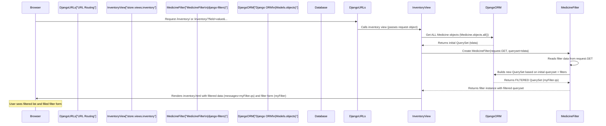

# Chapter 8: Data Filtering

Welcome back! We've covered a lot of ground building the core of our Pharmacy Management System. We know how our data is structured ([Chapter 1: Database Models](01_database_models_.md)), how the project is organized ([Chapter 2: Django Application (App)](02_django_application__app__.md), [Chapter 3: Django Project Settings](03_django_project_settings_.md)), how users interact via forms ([Chapter 4: Forms](04_forms_.md)), how the server handles requests ([Chapter 5: Views](05_views_.md)), how web addresses find the right logic ([Chapter 6: URL Routing](06_url_routing_.md)), and how we keep the system secure by knowing who is logged in ([Chapter 7: Authentication](07_authentication_.md)).

Now, imagine our pharmacy grows and we have hundreds, or even thousands, of medicines in the inventory, or countless sales records. Simply listing *all* of them on one page would be overwhelming and hard to use. How do we quickly find a specific medicine by its name, or a particular sale by the customer's phone number?

This is where **Data Filtering** comes in!

Data filtering is like having a super-powered "Find" or "Sort" function for your lists of data on a web page. It allows users to specify criteria (like "Medicine Name contains 'Aspirin'" or "Company is 'Pfizer'") to narrow down the displayed list and find exactly what they need without sifting through everything.

In our project, we use a helpful third-party Django library called `django-filters` to add filtering capabilities easily to our views and templates.

## What is `django-filters`?

`django-filters` simplifies the process of adding filtering to your Django application. It works by:

1.  Defining **FilterSets**: These are Python classes that look a bit like [Forms](04_forms_.md) or [Database Models](01_database_models_.md). They specify which fields from a model can be used for filtering and how the filtering should work (e.g., exact match, contains, greater than, etc.).
2.  Integrating with **Views**: In your views, you use the FilterSet to process the user's filter input (usually from the URL) and apply the filtering to the queryset (the list of data fetched from the database).
3.  Integrating with **Templates**: You pass the FilterSet to your template, and `django-filters` provides simple ways to render an HTML form containing the filter fields, allowing the user to enter their search criteria.

Think of `django-filters` as providing the tools to easily build those search/filter boxes you see on many websites (like online stores where you filter by price, brand, size, etc.).

## Defining Our Filters (`store/filters.py`)

Just like we defined our [Database Models](01_database_models_.md) in `models.py` and our [Forms](04_forms_.md) in `forms.py`, we define our filters in a dedicated file, often named `filters.py`, inside our app.

In our `store` app, we have `store/filters.py`:

```python
# File: store/filters.py

import django_filters # Import the django_filters library
from .models import * # Import our models (Medicine, Sold)

# Define a FilterSet for the Medicine model
class MedicineFilter(django_filters.FilterSet):
    # Define specific filter fields
    # CharFilter is for text-based fields
    # field_name: The name of the model field to filter on
    # lookup_expr: How to filter (e.g., 'icontains' means case-insensitive contains)
    # label: The user-friendly text displayed for the filter input field
    Medicine_Name = django_filters.CharFilter(field_name='Medicine_Name', lookup_expr='icontains', label='Medicine Name')
    Company_name = django_filters.CharFilter(field_name='Company_name', lookup_expr='icontains', label='Company Name')
    Company_ID = django_filters.CharFilter(field_name='Company_ID', lookup_expr='icontains', label='Company ID')
    # Note: Even though Company_ID is IntegerField in the model, filtering it as text
    # using icontains allows partial matches (e.g., searching for '12' finds '120', '212').

    class Meta: # Inner Meta class, similar to ModelForm
        model = Medicine # Link this FilterSet to the Medicine model
        fields = '__all__' # By default, include all fields from the model
        # But we exclude fields we don't want to filter on:
        exclude = ["Manufacturing_date","Expiry_date","Price", "stock"]


# Define a FilterSet for the Sold model
class SoldFilter(django_filters.FilterSet):
    # Define filter fields for sales records
    Customer_name = django_filters.CharFilter(field_name='Customer_name', lookup_expr='icontains', label='Customer Name')
    Phone_number = django_filters.CharFilter(field_name='Phone_number', lookup_expr='icontains', label='Phone Number' )
    # Filtering dates as text with 'icontains' isn't ideal for real dates,
    # but works simply for this example project's string format search.
    Purchase_date = django_filters.CharFilter(field_name='Purchase_date', lookup_expr='icontains', label='Purchase Date(MM/DD/YYYY)')

    class Meta: # Link to the Sold model
        model = Sold
        fields = '__all__' # Include all fields by default
        # Exclude fields we don't want to filter on:
        exclude = ["Person_ID","Medicine_ID","Medicine_Name","Company_ID","Company_name","Manufacturing_date","Expiry_date","Price","Quantity", "Bill_amount"]
```

Let's break down `MedicineFilter`:

*   `class MedicineFilter(django_filters.FilterSet):`: We define a class named `MedicineFilter` that inherits from `django_filters.FilterSet`. This tells `django-filters` what it is.
*   `Medicine_Name = django_filters.CharFilter(...)`: We explicitly define a filter field for `Medicine_Name`. We use `CharFilter` because `Medicine_Name` is a `CharField` in the model.
    *   `field_name='Medicine_Name'`: Links this filter field to the actual `Medicine_Name` field in the `Medicine` model.
    *   `lookup_expr='icontains'`: This is important! It tells Django how to perform the database query. `'icontains'` means "case-insensitive contains". So, if a user types "asp" in the Medicine Name filter, it will find "Aspirin", "ASPIRIN", "Contains asp", etc. Other lookup expressions exist for exact matches, greater than/less than for numbers/dates, etc.
    *   `label='Medicine Name'`: This text will appear next to the input box in the generated HTML filter form.
*   We define similar `CharFilter` fields for `Company_name` and `Company_ID`.
*   `class Meta:`: Inside the Meta class:
    *   `model = Medicine`: Specifies that this filter is based on the `Medicine` model.
    *   `fields = '__all__'`: Says we want to potentially create filters for *all* fields in the `Medicine` model.
    *   `exclude = [...]`: Lists the fields from the model that we *do not* want `django-filters` to automatically create filter fields for. This is useful when `fields = '__all__'` is too broad.

`SoldFilter` follows the same pattern, defining filters for relevant fields like `Customer_name`, `Phone_number`, and `Purchase_date` using `CharFilter` and the `icontains` lookup.

These FilterSet classes define *how* filtering can be done, but they don't *do* the filtering themselves yet. That happens in the [Views](05_views_.md).

## Using Filters in Views (`store/views.py`)

The logic for applying filters based on user input happens in the views that display the lists of data – `inventory` and `records`.

Let's look at the updated `inventory` view in `store/views.py`:

```python
# File: store/views.py (Inventory View Snippet with Filtering)

from django.shortcuts import render
from store.models import Medicine # Import our Medicine model
from .filters import MedicineFilter # Import the MedicineFilter we just defined
# ... other imports and decorators ...

@login_required(login_url='Login')
def inventory(request):
    # 1. Get the initial set of data (all medicines)
    # This is the queryset BEFORE any filtering is applied
    tdata = Medicine.objects.all()

    # 2. Create a filter instance
    # - Pass the request's GET parameters (where filter data from the form is sent)
    # - Pass the initial queryset (tdata)
    myFilter = MedicineFilter(request.GET, queryset=tdata)

    # 3. Apply the filter to the queryset
    # myFilter.qs holds the queryset AFTER filtering has been applied
    tdata = myFilter.qs # Now tdata contains only the filtered medicines

    # 4. Render the template
    # Pass the FILTERED data AND the filter instance itself to the template
    # Passing the filter instance allows the template to render the filter form
    return render(request, 'store/inventory.html', {"messages": tdata, "myFilter": myFilter})

# ... other views ...
```

Here's the breakdown:

1.  `tdata = Medicine.objects.all()`: First, we fetch *all* the `Medicine` objects from the database. This is our starting point, the complete list before filtering.
2.  `myFilter = MedicineFilter(request.GET, queryset=tdata)`: This is the key step.
    *   We create an instance of our `MedicineFilter`.
    *   `request.GET`: We pass `request.GET`. When a user fills out the filter form in the template and submits it (usually via a `GET` request), their input appears in the URL as query parameters (like `/inventory/?Medicine_Name=asp&Company_name=pfizer`). `request.GET` is a dictionary containing these query parameters. `django-filters` reads this data to know what the user wants to filter by.
    *   `queryset=tdata`: We tell the filter instance to operate on our initial `tdata` queryset.
3.  `tdata = myFilter.qs`: `myFilter` now has the logic to apply the filters based on `request.GET` to the initial `queryset`. The `myFilter.qs` property holds the *resulting, filtered queryset*. We update `tdata` to be this filtered list.
4.  `return render(...)`: We render the `inventory.html` template. Crucially, we pass:
    *   `"messages": tdata`: The *filtered* list of medicines to be displayed in the table.
    *   `"myFilter": myFilter`: The filter instance itself. This is passed so the template can easily render the HTML filter form for the user to interact with.

The `records` view in `store/views.py` uses the `SoldFilter` in exactly the same way:

```python
# File: store/views.py (Records View Snippet with Filtering)

from django.shortcuts import render
from store.models import Sold # Import our Sold model
from .filters import SoldFilter # Import the SoldFilter we just defined
# ... other imports and decorators ...

@login_required(login_url='Login')
def records(request):
    # 1. Get initial data (all sales records)
    tdata = Sold.objects.all()

    # 2. Create a SoldFilter instance, passing GET data and the initial queryset
    myFilter = SoldFilter(request.GET, queryset=tdata)

    # 3. Apply the filter
    tdata = myFilter.qs # tdata is now the filtered list of sales records

    # 4. Render the template, passing filtered data AND the filter instance
    return render(request, 'store/records.html', {"messages": tdata, "myFilter": myFilter})
```

The process is identical, just using the `Sold` model and `SoldFilter`.

## Using Filters in Templates (Brief Overview)

Once the `myFilter` instance is passed from the view to the template (`inventory.html` or `records.html`), you can display the filter form to the user.

While we won't dive deep into template code in this chapter, the basic idea in your template is to create an HTML `<form>` and then use template tags provided by `django-filters` (or by accessing the filter's form property) to render the input fields defined in your FilterSet.

```html
<!-- Example snippet you might find in store/inventory.html -->
<form method="get">
    {{ myFilter.form.as_p }} <!-- Renders filter fields as paragraphs -->
    <button type="submit">Search / Filter</button>
    <a href="">Clear Filter</a> {# Link back to the unfiltered view #}
</form>

<!-- Then, later in the template, display the data: -->
<table>
    <thead>...</thead>
    <tbody>
         {# Iterate through the FILTERED 'messages' #}
            <tr>
                <td>{{ message.Medicine_Name }}</td>
                <td>{{ message.Company_name }}</td>
                {# ... display other medicine details ... #}
            </tr>
        
    </tbody>
</table>
```

*   `<form method="get">`: The filter form typically uses the `GET` method so the filter criteria appear in the URL, which is convenient for bookmarking or sharing filtered views.
*   `{{ myFilter.form.as_p }}`: This uses a common Django form rendering method (`as_p` renders each field in a `<p>` tag) to display the input fields for `Medicine_Name`, `Company_name`, `Company_ID` based on our `MedicineFilter` definition.
*   When the user submits this form, the values they entered are sent to the `inventory` view in `request.GET`, which is exactly what `myFilter = MedicineFilter(request.GET, ...)` expects.
*   The `` loop then iterates over the `messages` variable passed from the view, which contains the *filtered* queryset (`myFilter.qs`).

## How Data Filtering Works (Simplified Flow)

Let's visualize the process when a user filters the inventory:



Key steps:

1.  The browser sends a request, potentially with filter criteria in the URL query string (`?field=value&...`).
2.  URL Routing directs the request to the `inventory` view.
3.  The `inventory` view first gets the *complete* list of items as a queryset.
4.  It creates a `MedicineFilter` instance, giving it the filter criteria from `request.GET` and the complete queryset.
5.  The `MedicineFilter` processes the filter criteria and builds a *new* queryset that represents the *filtered* data.
6.  The view then uses this filtered queryset for the rest of its logic (in this case, passing it to the template).
7.  The view also passes the `MedicineFilter` instance to the template so the filter form can be displayed, allowing the user to see their current filters and apply new ones.

This pattern allows you to keep your core view logic simple while adding powerful filtering capabilities easily using the `django-filters` library.

## Summary

In this chapter, we learned about **Data Filtering**, a crucial feature for making large lists of data manageable and searchable in our Pharmacy Management System.

*   Filtering allows users to narrow down lists like Inventory and Records based on specific criteria.
*   We use the `django-filters` library to implement filtering.
*   Filtering logic is defined in `filters.py` using `FilterSet` classes (like `MedicineFilter` and `SoldFilter`), which specify which model fields can be filtered and how.
*   In our [Views](05_views_.md), we create an instance of the relevant `FilterSet`, passing it the filter data from `request.GET` and the initial queryset. The `.qs` property of the filter instance gives us the resulting filtered queryset.
*   We pass both the filtered queryset and the filter instance to the template to display the filtered data and the interactive filter form.
*   This makes our Inventory and Records pages much more user-friendly and efficient for finding specific information.

Filtering significantly enhances the usability of our application, allowing users to quickly access the specific data they need from potentially large datasets.

With filtering covered, we've built most of the core pieces of our Pharmacy Management System: data storage, project structure, configuration, user input, request handling, navigation, security, and data searching.

This concludes our tutorial chapters based on the provided structure! We've gone from defining data structures to building a secure, navigable application that can display and filter records.
