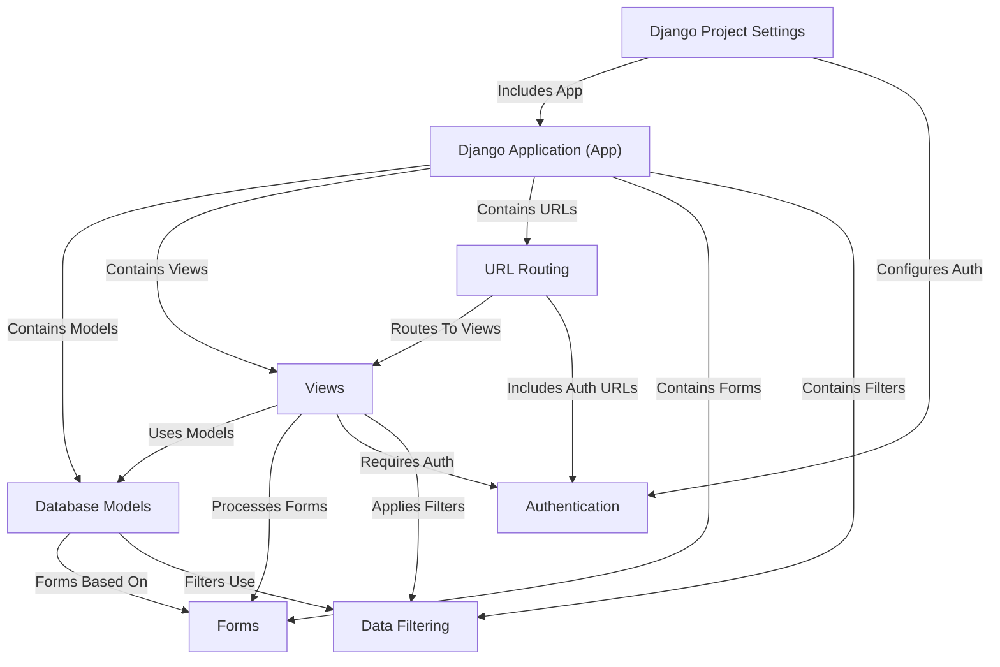

# Tutorial: Pharmacy-Management-System

This project is a **Pharmacy Management System** built with Django.
Its main purpose is to help manage **medicine inventory** and track **sales records**.
Users can sign up, log in, add new medicines, view and update inventory stock,
record medicine sales, and see a history of all transactions, with features for **searching** and **filtering** data.

### Check out the live website here: [Pharmacy Management System](https://shubhampawar.pythonanywhere.com/)

## Visual Overview

## Chapters

1. [Database Models
](01_database_models_.md)
2. [Django Application (App)
](02_django_application__app__.md)
3. [Django Project Settings
](03_django_project_settings_.md)
4. [Forms
](04_forms_.md)
5. [Views
](05_views_.md)
6. [URL Routing
](06_url_routing_.md)
7. [Authentication
](07_authentication_.md)
8. [Data Filtering
](08_data_filtering_.md)
